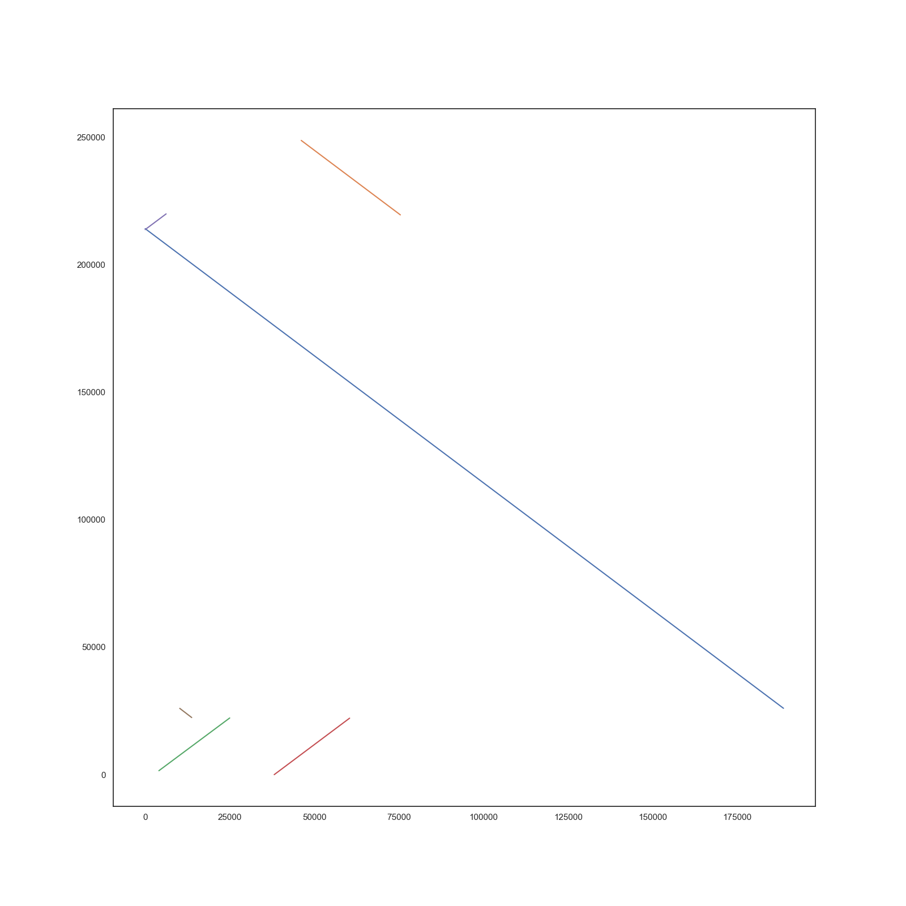

# Rat
Python script for extracting and grouping alignments from a single metagenomic assembly via population reference.
Results are exported to .paf files for each provided fasta reference and best matching contigs are dot-plotted.


## Usage
```
python3 rat [-h] [--threshold THRESHOLD] [--best_n BEST_N] [-t N_THREADS]
         assembly_fasta ref_dir out_dir

Takes a metagenomic assembly and a folder containing population fasta references.
                    Prints most promising overlaps to paf at specified location.

                    Format: rat [options] <assembly.(fasta|fa)> <ref_dir> <out_dir>

positional arguments:
  assembly_fasta
  ref_dir
  out_dir

optional arguments:
  -h, --help            show this help message and exit
  --threshold THRESHOLD
                        Overlaps with lower length are discarded. Default: 10000
  --best_n BEST_N       Number of the longest overlaps taken as valid matches. Default=10
  -t N_THREADS          Number of threads used by minimap. Default=3
```

## Result examples

### Directory structure
```
rat_overlaps
├── Bacillus_subtilis_complete_genome
│   ├── Utg5.png
│   └── overlaps.paf
├── Cryptococcus_neoformans_draft_genome
│   ├── Utg4.png
│   └── overlaps.paf
├── Enterococcus_faecalis_complete_genome
│   ├── Utg62.png
│   └── overlaps.paf
├── Escherichia_coli_complete_genome
│   ├── Utg58.png
│   └── overlaps.paf
├── Lactobacillus_fermentum_complete_genome
│   ├── Utg55.png
│   └── overlaps.paf
├── Listeria_monocytogenes_complete_genome
│   ├── Utg44.png
│   └── overlaps.paf
├── Pseudomonas_aeruginosa_complete_genome
│   ├── Utg85.png
│   └── overlaps.paf
├── Saccharomyces_cerevisiae_draft_genome
│   ├── Utg8.png
│   └── overlaps.paf
├── Salmonella_enterica_complete_genome
│   ├── Utg289.png
│   └── overlaps.paf
└── Staphylococcus_aureus_complete_genome
    ├── Utg15.png
    └── overlaps.paf

10 directories, 20 files

```

### Plot:
  
*** 

Under development